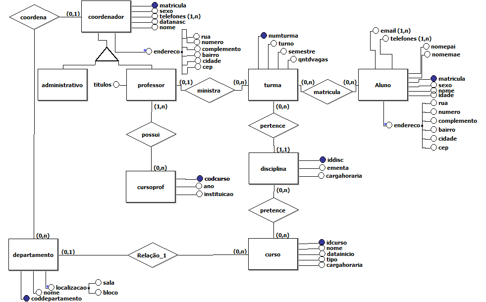

# EngDados  
Repositorio para matéria de Engenharia de Dados
### Projessor  
Anderson Nascimento
# Programas Utilizados  
BRModels  http://www.sis4.com/brModelo/antigo.html  
RelaX https://dbis-uibk.github.io/relax/landing  

# AC
### Modelo Conceitual
  
### Modelo Logico  
[[Modelo Logico](./AC/ModeloLogico_AC.docx)]  

